# N4ughtyLLM Gate

*Last updated: March 24, 2026.*

**Open-source security gateway for LLM API calls** — sits between your AI agents/apps and upstream LLM providers, enforcing security policies on both request and response sides.

## What is N4ughtyLLM Gate?

N4ughtyLLM Gate is a self-hosted, pipeline-based security proxy designed to protect LLM API traffic. Point your application's `baseUrl` at the gateway, and it automatically applies PII redaction, prompt injection detection, dangerous command blocking, and output sanitization before forwarding to the real upstream model.

### Key Features

- **Prompt Injection Protection** — Multi-layer detection: regex patterns, TF-IDF semantic classifier (bilingual EN/ZH, no GPU required), Unicode/encoding attack detection, typoglycemia defense
- **PII / Secret Redaction** — 50+ pattern categories covering API keys, tokens, credit cards, SSNs, crypto wallet addresses/seed phrases, medical records, and infrastructure identifiers
- **Dangerous Response Sanitization** — Automatic obfuscation of high-risk LLM outputs (shell commands, SQL injection payloads, HTTP smuggling) with configurable security levels (low/medium/high)
- **OpenAI-Compatible API** — Drop-in replacement for `/v1/chat/completions`, `/v1/responses`, and generic proxy; works with any OpenAI-compatible provider
- **Native Upstream Engine** — Built-in provider registry with encrypted credentials, model-group routing policies (weighted/failover), live circuit breaker, and health checks — no external proxy wrappers required
- **MCP & Agent SKILL Support** — Integrates with Cursor, Claude Code, Codex, Windsurf and other AI coding agents via Model Context Protocol
- **Token-Based Routing** — Route requests to multiple upstream providers through a single gateway with per-token upstream mapping and whitelist controls
- **Web Management Console** — Built-in admin UI for configuration, token management, security rules CRUD, key rotation, and real-time request statistics
- **Flexible Deployment** — Docker Compose one-click deploy, supports SQLite/Redis/PostgreSQL backends, Caddy TLS termination

### Use Cases

- **Protect sensitive data** from leaking to LLM providers (PII, API keys, internal URLs)
- **Detect and block prompt injection attacks** in real-time across your AI agent fleet
- **Centralize security policy** instead of implementing protections in every AI application
- **Audit LLM interactions** with structured logging, risk scoring, and dangerous content tracking
- **Secure MCP tool calls** — guard against malicious tool invocations and privilege escalation
- **Multi-provider routing** — automatically route by model name across weighted or failover provider pools, with automatic circuit tripping on failures

### How It Compares

| Feature | N4ughtyLLM Gate | LLM Guard | Rebuff | Prompt Armor |
|---------|-----------|-----------|--------|--------------|
| Self-hosted gateway proxy | Yes | Library only | API service | API service |
| Request + Response filtering | Both sides | Both sides | Request only | Request only |
| OpenAI-compatible drop-in | Yes | No | No | No |
| Built-in PII redaction | 50+ patterns | Yes | No | No |
| Native multi-provider routing | Yes (weighted/failover + circuit breaker) | N/A | N/A | N/A |
| Web management UI | Yes | No | No | Dashboard |
| MCP / Agent SKILL support | Yes | No | No | No |
| No external API dependency | Yes (TF-IDF local) | Yes | No (OpenAI) | No |
| Bilingual (EN/ZH) | Yes | English | English | English |

> **Quick start:** `docker compose up -d` — gateway runs on port 18080, admin UI at `http://localhost:18080/__ui__`

### Architecture

```mermaid
flowchart LR
    subgraph Clients
        A1[AI Agent / Cursor / Claude Code]
        A2[Web App / API Client]
    end

    subgraph N4LMGate["N4ughtyLLM Gate Security Gateway"]
        direction TB
        MW[Token & Provider Router]

        subgraph ReqPipeline["Request Pipeline"]
            R1[PII Redaction<br/>50+ patterns]
            R2[Exact-Value Redaction<br/>API keys, secrets]
            R3[Request Sanitizer<br/>injection & leak detection]
            R4[RAG Poison Guard]
        end

        subgraph RespPipeline["Response Pipeline"]
            S1[Injection Detector<br/>regex + TF-IDF semantic]
            S2[Anomaly Detector<br/>encoding & command patterns]
            S3[Privilege Guard]
            S4[Tool Call Guard]
            S5[Restoration &<br/>Post-Restore Guard]
            S6[Output Sanitizer<br/>block / sanitize / pass]
        end

        subgraph UpstreamEngine["Native Upstream Engine"]
            UE1[Provider Registry<br/>encrypted credentials]
            UE2[Model-Group Policies<br/>weighted / failover]
            UE3[Circuit Breaker<br/>live traffic feedback]
        end

        MW --> ReqPipeline
        MW --> UpstreamEngine
    end

    subgraph Upstream["Upstream LLM Providers"]
        U1[OpenAI / Claude / Gemini]
        U2[Self-hosted LLM]
        U3[Any OpenAI-compatible API]
    end

    A1 & A2 -->|"baseUrl → gateway"| MW
    ReqPipeline -->|filtered request| UpstreamEngine
    UpstreamEngine -->|routed request| U1 & U2 & U3
    U1 & U2 & U3 -->|raw response| RespPipeline
    RespPipeline -->|sanitized response| A1 & A2
```



### Frequently Asked Questions

**What is N4ughtyLLM Gate?**
N4ughtyLLM Gate is an open-source, self-hosted security gateway that sits between your AI applications and LLM API providers. It inspects and filters both requests and responses in real-time, protecting against prompt injection, PII leakage, and dangerous LLM outputs.

**How does N4ughtyLLM Gate detect prompt injection?**
N4ughtyLLM Gate uses a multi-layer approach: (1) bilingual regex patterns for known injection techniques (direct injection, system prompt exfiltration, typoglycemia obfuscation), (2) a built-in TF-IDF + Logistic Regression semantic classifier that runs locally without GPU, and (3) Unicode/encoding attack detection for invisible characters, bidirectional control abuse, and multi-stage encoded payloads.

**Does N4ughtyLLM Gate work with OpenAI, Claude, and other LLM providers?**
Yes. N4ughtyLLM Gate provides an OpenAI-compatible API (`/v1/chat/completions`, `/v1/responses`) and a generic HTTP proxy (`/v2/`). Any application that supports a custom `baseUrl` can use N4ughtyLLM Gate as a drop-in proxy. It has been verified with OpenAI, Claude (via compatible proxies), Gemini, and any OpenAI-compatible API.

**What data does N4ughtyLLM Gate redact?**
Over 50 PII pattern categories including: API keys and tokens (OpenAI, AWS, GitHub, Slack), credit card numbers, SSNs, email addresses, phone numbers, crypto wallet addresses and seed phrases, medical record numbers, IP addresses, internal URLs, and infrastructure identifiers. Custom exact-value redaction is also supported for arbitrary secrets.

**Can I use N4ughtyLLM Gate with AI coding agents like Cursor, Claude Code, or Codex?**
Yes. N4ughtyLLM Gate supports MCP (Model Context Protocol) and Agent SKILL integration. Point your agent's `baseUrl` to the gateway and it will transparently filter all LLM traffic. See [SKILL.md](SKILL.md) for agent-specific setup instructions.

**How does N4ughtyLLM Gate handle dangerous LLM responses?**
Responses are scored by multiple filters (injection detector, anomaly detector, privilege guard, tool call guard). Based on the cumulative risk score and configurable security level (low/medium/high), the gateway either passes the response through, sanitizes dangerous fragments (replacing them with safe markers), or blocks the entire response. Streaming responses are checked incrementally and can be terminated mid-stream.

**Does N4ughtyLLM Gate require an external AI service for detection?**
No. The built-in TF-IDF semantic classifier runs locally (~166KB model file) without GPU. All regex-based detection also runs locally. An optional external semantic service can be configured for advanced use cases, but is not required.

**How do I deploy N4ughtyLLM Gate?**
The recommended method is Docker Compose: `docker compose up -d`. The gateway runs on port 18080 with a built-in web management console at `/__ui__`. It supports SQLite (default), Redis, or PostgreSQL as storage backends. For production, place Caddy or nginx in front for TLS termination.

**Do I need CLIProxyAPI, Sub2API, or AIClient-2-API?**
No. Those external wrapper projects are no longer required. N4ughtyLLM Gate includes a native upstream engine: register providers directly via `POST /__gw__/providers`, configure routing policies and circuit breakers, and route traffic without any third-party proxy shim.


## Getting Started

### Before You Run

1. **Copy the example config** and fill in your upstream URL and key:

   ```bash
   cp config/.env.example config/.env
   ```

   At minimum set `N4UGHTYLLM_GATE_UPSTREAM_BASE_URL` and `N4UGHTYLLM_GATE_GATEWAY_KEY` in `config/.env`.

2. **Install with dev extras:**

   ```bash
   pip install -e ".[dev,semantic]"
   ```

   Add optional extras as needed: `[redis]`, `[postgres]`, `[observability]`.

3. **Run the gateway** — choose one:

   ```bash
   # Native (hot-reload, recommended for development)
   uvicorn n4ughtyllm_gate.core.gateway:app --host 127.0.0.1 --port 18080 --reload

   # Docker (production-style, no local Python install required)
   docker compose up -d --build
   ```

---

### Technical identifiers (stability)

The product name is **N4ughtyLLM Gate**. For backward compatibility with existing installs, tooling, and configs, the implementation uses:

- **Python package / import path** — `n4ughtyllm_gate` (e.g. `pip install -e .`, `uvicorn …` below)
- **Environment variables** — every tunable is prefixed with **`N4UGHTYLLM_GATE_`** (see Configuration)
- **Optional HTTP headers** — gateway-specific headers use the **`x-n4ughtyllm-gate-*`** pattern (e.g. request correlation, HMAC, redaction hints)
- **Docker Compose service name** — `n4ughtyllm_gate` in sample stacks

These names are intentional and stable; they are not the public product name.

### Docker Compose (Recommended)

```bash
git clone https://github.com/ax128/N4ughtyLLM-Gate.git n4ughtyllm-gate
cd n4ughtyllm-gate
docker compose up -d --build
```

Health check: `curl http://127.0.0.1:18080/health`

Admin UI: `http://localhost:18080/__ui__`

### Local Development (No Docker)

```bash
python3 -m venv .venv && source .venv/bin/activate
pip install -e ".[dev,semantic]"
uvicorn n4ughtyllm_gate.core.gateway:app --host 127.0.0.1 --port 18080
```

---

## Upstream Integration

N4ughtyLLM Gate includes a **native upstream engine**: a built-in provider registry with encrypted credentials, model-group routing policies, a live circuit breaker, and health checks. No external proxy wrappers are required.

### Provider Management

Register and manage upstream providers via admin API. Credentials are stored encrypted at rest. Provider auth injection supports `bearer`, `x-api-key`, or `none`.

| Method | Endpoint | Description |
|--------|----------|-------------|
| `POST` | `/__gw__/providers` | Create or update a provider |
| `GET` | `/__gw__/providers` | List all providers |
| `GET` | `/__gw__/providers/{provider_id}` | Fetch one provider |
| `DELETE` | `/__gw__/providers/{provider_id}` | Delete a provider |
| `GET` | `/__gw__/providers/{provider_id}/health` | Live health probe |

Example registration:

```bash
curl -X POST http://127.0.0.1:18080/__gw__/providers \
  -H "Content-Type: application/json" \
  -d '{
    "gateway_key": "<YOUR_GATEWAY_KEY>",
    "provider_id": "openai-main",
    "display_name": "OpenAI Main",
    "upstream_base": "https://api.openai.com/v1",
    "api_key": "sk-...",
    "auth_mode": "bearer"
  }'
```

### Model-Group Routing Policies

Routing policies distribute traffic across providers by model name pattern, using **weighted** (percentage split) or **failover** (priority-ordered) strategies.

| Method | Endpoint | Description |
|--------|----------|-------------|
| `POST` | `/__gw__/routing-policies` | Create or update a policy |
| `GET` | `/__gw__/routing-policies` | List all policies |
| `GET` | `/__gw__/routing-policies/{group_id}` | Fetch one policy |
| `DELETE` | `/__gw__/routing-policies/{group_id}` | Delete a policy |
| `GET` | `/__gw__/routing/resolve?model=...` | Preview which provider would be selected |

Supported strategies:
- `failover` — pick the highest-priority healthy provider that matches the model name
- `weighted` — distribute requests across healthy providers by configured weight ratios

Example policy (80/20 weighted split across two providers for all GPT-5 models):

```bash
curl -X POST http://127.0.0.1:18080/__gw__/routing-policies \
  -H "Content-Type: application/json" \
  -d '{
    "gateway_key": "<YOUR_GATEWAY_KEY>",
    "group_id": "gpt5-main",
    "model_patterns": ["gpt-5*", "o*"],
    "strategy": "weighted",
    "providers": [
      {"provider_id": "openai-main",   "weight": 8, "priority": 100},
      {"provider_id": "openai-backup", "weight": 2, "priority": 100}
    ]
  }'
```

Configuration file: `config/upstream_routing.json` (template: `config/upstream_routing.json.example`).

### Circuit Breaker

The circuit breaker automatically tracks live upstream failures per provider and removes unhealthy providers from routing pools without manual intervention.

**How it works:**
1. Every failed upstream HTTP call (5xx or connection error) increments the provider's consecutive failure counter.
2. Once the failure count reaches `circuit_breaker_failure_threshold` (default: 3), the circuit **trips open** and the provider is excluded from model-group routing.
3. The open window uses exponential backoff starting at `circuit_breaker_base_open_seconds` (default: 10s), capped at `circuit_breaker_max_open_seconds` (default: 300s).
4. After the window expires the circuit enters **half-open** and allows a probe request through. A successful probe closes the circuit; a failed probe re-trips it.
5. Explicit health-check calls (`GET /__gw__/providers/{id}/health`) also update the circuit state.

| Method | Endpoint | Description |
|--------|----------|-------------|
| `GET` | `/__gw__/circuit` | List all provider circuit states |
| `GET` | `/__gw__/circuit/{provider_id}` | Single provider circuit state |
| `POST` | `/__gw__/circuit/{provider_id}/reset` | Force-close (admin override) |

Circuit breaker settings (all configurable via `config/.env`):

| Variable | Default | Description |
|----------|---------|-------------|
| `N4UGHTYLLM_GATE_CIRCUIT_BREAKER_ENABLED` | `true` | Enable/disable circuit breaker |
| `N4UGHTYLLM_GATE_CIRCUIT_BREAKER_FAILURE_THRESHOLD` | `3` | Consecutive failures before trip |
| `N4UGHTYLLM_GATE_CIRCUIT_BREAKER_BASE_OPEN_SECONDS` | `10.0` | Minimum open window (exponential backoff base) |
| `N4UGHTYLLM_GATE_CIRCUIT_BREAKER_MAX_OPEN_SECONDS` | `300.0` | Maximum open window cap |
| `N4UGHTYLLM_GATE_CIRCUIT_BREAKER_SUCCESS_THRESHOLD` | `2` | Probe successes needed to close |
| `N4UGHTYLLM_GATE_CIRCUIT_BREAKER_JITTER_FACTOR` | `0.1` | Jitter (0–1) on open window to spread recovery |

### Routing Scenarios

#### Scenario 1: Provider-bound URL route

Bind requests directly to a provider id in the URL — no token registration needed:

```
Client → /v1/__gw__/p/{provider_id}/chat/completions → upstream for that provider
```

Supports filter mode suffixes: `provider__redact` (redaction only) and `provider__passthrough` (full passthrough). Works for both `/v1` and `/v2` routes.

#### Scenario 2: Header-driven provider routing

Bind by header without URL rewriting:

```bash
curl -X POST http://127.0.0.1:18080/v1/responses \
  -H "x-n4ughtyllm-gate-provider: openai-main" \
  -H "Content-Type: application/json" \
  -d '{"model":"gpt-5.4","input":"hello"}'
```

Optional model hint header: `x-n4ughtyllm-gate-model`.

#### Scenario 3: Automatic model-group policy routing

For direct `/v1/*` requests with no token path and no provider header, the gateway auto-selects a provider by model group policy. This is the fully automatic path — define policies once, send requests normally.

#### Scenario 4: Default upstream (single-provider fast path)

Set `N4UGHTYLLM_GATE_UPSTREAM_BASE_URL` and call `/v1/...` directly without any routing configuration.

#### Scenario 5: Legacy token routes (still supported)

Token-based routes remain available for backward compatibility:
- `POST /__gw__/register`, `POST /__gw__/add`, `POST /__gw__/remove`, `POST /__gw__/lookup`, `POST /__gw__/unregister`
- Route format: `/v1/__gw__/t/{token}/...` and `/v2/__gw__/t/{token}/...`

See [Caddyfile.example](Caddyfile.example) for public TLS deployment.

---

## Core Capabilities

### API Endpoints

- **OpenAI-compatible** (full security pipeline): `POST /v1/chat/completions`, `POST /v1/responses`
- **v2 Generic HTTP Proxy**: `ANY /v2/__gw__/t/<token>/...` (requires `x-target-url` header)
- **Provider route binding**: `ANY /v1/__gw__/p/<provider_id>/...` and `ANY /v2/__gw__/p/<provider_id>/...`
- **Generic pass-through**: `POST /v1/{subpath}` — forwards any other `/v1/` path to upstream without running the security filter pipeline; use for non-OpenAI providers that need transparent proxying

Compatibility notes:

- If a client sends a Responses-style payload (`input`) to `/v1/chat/completions`, N4ughtyLLM Gate forwards it upstream as `/v1/responses` but converts the result back to Chat Completions JSON/SSE for the client.
- If a client sends a Chat-style payload (`messages`) to `/v1/responses`, N4ughtyLLM Gate applies the inverse compatibility mapping and returns Responses-shaped output.

### Security Pipeline

**Request side:** PII redaction → exact-value redaction → request sanitizer → RAG poison guard

**Response side:** injection detector → anomaly detector → privilege guard → tool call guard → restoration → post-restore guard → output sanitizer

### Dangerous Content Handling

| Risk Level | Action | Examples |
|------------|--------|----------|
| **Safe** | Pass through | Normal conversation |
| **Low risk** | Chunked-hyphen obfuscation (insert `-` every 3 chars) | `dev-elo-per mes-sag-e` |
| **High risk / dangerous commands** | Replace with safety marker | SQL injection, reverse shell, `rm -rf` |
| **Spam noise** | Replace with `[N4ughtyLLM Gate:spam-content-removed]` | Gambling/porn spam + fake tool calls |

### PII Redaction Coverage (50+ categories)

- **Credentials**: API keys, JWT, cookies, private keys (PEM), AWS access/secret, GitHub/Slack tokens
- **Financial**: credit cards, IBAN, SWIFT/BIC, routing numbers, bank accounts
- **Network & Devices**: IPv4/IPv6, MAC, IMEI/IMSI, device serial numbers
- **Identity & Compliance**: SSN, tax IDs, passport/driver's license, medical records
- **Crypto**: BTC/ETH/SOL/TRON addresses, WIF/xprv/xpub, seed phrases, exchange API keys
- **Infrastructure** (relaxed mode): hostnames, OS versions, container IDs, K8s resources, internal URLs

---

## Configuration

Set values in `config/.env`. Every variable name uses the **`N4UGHTYLLM_GATE_`** prefix.

| Variable | Default | Description |
|----------|---------|-------------|
| `N4UGHTYLLM_GATE_HOST` | `127.0.0.1` | Listen address |
| `N4UGHTYLLM_GATE_PORT` | `18080` | Listen port |
| `N4UGHTYLLM_GATE_UPSTREAM_BASE_URL` | _(empty)_ | Default upstream URL (no token or provider needed) |
| `N4UGHTYLLM_GATE_SECURITY_LEVEL` | `medium` | Security strictness: `low` / `medium` / `high` |
| `N4UGHTYLLM_GATE_RISK_SCORE_THRESHOLD` | `0.7` | Risk score threshold (0–1); lower = stricter. Overridden per-policy by `risk_threshold` in policy YAML (default policy uses `0.85`) |
| `N4UGHTYLLM_GATE_STORAGE_BACKEND` | `sqlite` | Storage: `sqlite` / `redis` / `postgres` |
| `N4UGHTYLLM_GATE_ENFORCE_LOOPBACK_ONLY` | `true` | Restrict access to loopback; set `false` for Docker |
| `N4UGHTYLLM_GATE_ENABLE_V2_PROXY` | `true` | Enable v2 generic HTTP proxy |
| `N4UGHTYLLM_GATE_ENABLE_REDACTION` | `true` | Enable PII redaction |
| `N4UGHTYLLM_GATE_ENABLE_INJECTION_DETECTOR` | `true` | Enable prompt injection detection |
| `N4UGHTYLLM_GATE_STRICT_COMMAND_BLOCK_ENABLED` | `false` | Force-block on dangerous command match |
| `N4UGHTYLLM_GATE_MAX_REQUEST_BODY_BYTES` | `12000000` | Maximum request body size in bytes |
| `N4UGHTYLLM_GATE_FILTER_PIPELINE_TIMEOUT_S` | `90` | Filter pipeline timeout in seconds |
| `N4UGHTYLLM_GATE_REQUEST_PIPELINE_TIMEOUT_ACTION` | `block` | Action on request pipeline timeout: `block` or `pass` |
| `N4UGHTYLLM_GATE_UPSTREAM_TIMEOUT_SECONDS` | `600` | Upstream request timeout in seconds |
| `N4UGHTYLLM_GATE_ENABLE_REQUEST_HMAC_AUTH` | `false` | Enable HMAC signature verification for requests |
| `N4UGHTYLLM_GATE_TRUSTED_PROXY_IPS` | _(empty)_ | Comma-separated trusted reverse-proxy IPs/CIDRs for X-Forwarded-For |
| `N4UGHTYLLM_GATE_CIRCUIT_BREAKER_ENABLED` | `true` | Enable runtime circuit breaker for upstream providers |
| `N4UGHTYLLM_GATE_CIRCUIT_BREAKER_FAILURE_THRESHOLD` | `3` | Consecutive failures before circuit trips |
| `N4UGHTYLLM_GATE_CIRCUIT_BREAKER_BASE_OPEN_SECONDS` | `10.0` | Minimum circuit open window (seconds) |
| `N4UGHTYLLM_GATE_CIRCUIT_BREAKER_MAX_OPEN_SECONDS` | `300.0` | Maximum circuit open window cap |
| `N4UGHTYLLM_GATE_CIRCUIT_BREAKER_SUCCESS_THRESHOLD` | `2` | Probe successes to close circuit in half-open state |
| `N4UGHTYLLM_GATE_CIRCUIT_BREAKER_JITTER_FACTOR` | `0.1` | Jitter factor (0–1) applied to open window |

Full reference: [`config/.env.example`](config/.env.example) and [`config/README.md`](config/README.md).

---

## Agent Skill

Agent-executable installation and integration guide: [SKILL.md](SKILL.md)

---

## Development

```bash
pip install -e ".[dev,semantic]"
pytest -q
```

Optional observability support:

```bash
pip install -e ".[observability]"
```

With the observability extra installed, N4ughtyLLM Gate exposes `/metrics` for Prometheus scraping and initializes the OpenTelemetry provider/exporter during startup. `/metrics` does not have a dedicated auth layer; it inherits the gateway's normal network and auth controls.

---

## Troubleshooting

### `sqlite3.OperationalError: unable to open database file`
Check `config/.env`: the SQLite path variable must point to a writable file and the host/volume must allow writes.

### Token path returns `token_not_found`
The token is missing from the map, was removed, or the token map file in `config/.env` is not on persistent storage across restarts.

### Upstream returns 4xx/5xx
Gateway transparently forwards upstream errors. Verify upstream availability independently first.

### Provider circuit is open / requests routed to wrong provider
Check circuit state: `GET /__gw__/circuit`. If a provider was tripped by transient failures, reset it manually: `POST /__gw__/circuit/{provider_id}/reset`. Adjust `N4UGHTYLLM_GATE_CIRCUIT_BREAKER_FAILURE_THRESHOLD` to be more or less sensitive.

### Streaming logs show `upstream_eof_no_done` or `terminal_event_no_done_recovered:*`
Two different cases are logged separately:

- `upstream_eof_no_done`: upstream closed the stream without sending `data: [DONE]`; the gateway auto-recovers by synthesizing a completion event.
- `terminal_event_no_done_recovered:response.completed|response.failed|error`: the gateway already received an explicit terminal event from upstream, but upstream closed before sending `[DONE]`.

### v2 returns `missing_target_url_header`
The `x-target-url` header is required for v2 proxy requests. Include the full target URL with query string.

---

## License

[MIT](LICENSE)
