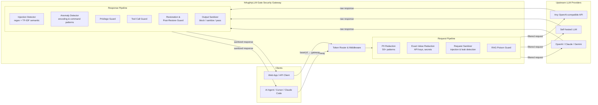

# N4ughtyLLM Gate - © 2026 Repacked Tools (PTY). All rights reserved.

*Last updated: March 24, 2026.*


**Open-source security gateway for LLM API calls** — sits between your AI agents/apps and upstream LLM providers, enforcing security policies on both request and response sides.

## What is N4ughtyLLM Gate?

N4ughtyLLM Gate is a self-hosted, pipeline-based security proxy designed to protect LLM API traffic. Point your application's `baseUrl` at the gateway, and it automatically applies PII redaction, prompt injection detection, dangerous command blocking, and output sanitization before forwarding to the real upstream model.

### Key Features

- **Prompt Injection Protection** — Multi-layer detection: regex patterns, TF-IDF semantic classifier (bilingual EN/ZH, no GPU required), Unicode/encoding attack detection, typoglycemia defense
- **PII / Secret Redaction** — 50+ pattern categories covering API keys, tokens, credit cards, SSNs, crypto wallet addresses/seed phrases, medical records, and infrastructure identifiers
- **Dangerous Response Sanitization** — Automatic obfuscation of high-risk LLM outputs (shell commands, SQL injection payloads, HTTP smuggling) with configurable security levels (low/medium/high)
- **OpenAI-Compatible API** — Drop-in replacement for `/v1/chat/completions`, `/v1/responses`, and generic proxy; works with any OpenAI-compatible provider
- **MCP & Agent SKILL Support** — Integrates with Cursor, Claude Code, Codex, Windsurf and other AI coding agents via Model Context Protocol
- **Token-Based Routing** — Route requests to multiple upstream providers through a single gateway with per-token upstream mapping and whitelist controls
- **Web Management Console** — Built-in admin UI for configuration, token management, security rules CRUD, key rotation, and real-time request statistics
- **Flexible Deployment** — Docker Compose one-click deploy, supports SQLite/Redis/PostgreSQL backends, Caddy TLS termination

### Use Cases

- **Protect sensitive data** from leaking to LLM providers (PII, API keys, internal URLs)
- **Detect and block prompt injection attacks** in real-time across your AI agent fleet
- **Centralize security policy** instead of implementing protections in every AI application
- **Audit LLM interactions** with structured logging, risk scoring, and dangerous content tracking
- **Secure MCP tool calls** — guard against malicious tool invocations and privilege escalation

### How It Compares

| Feature | N4ughtyLLM Gate | LLM Guard | Rebuff | Prompt Armor |
|---------|-----------|-----------|--------|--------------|
| Self-hosted gateway proxy | Yes | Library only | API service | API service |
| Request + Response filtering | Both sides | Both sides | Request only | Request only |
| OpenAI-compatible drop-in | Yes | No | No | No |
| Built-in PII redaction | 50+ patterns | Yes | No | No |
| Web management UI | Yes | No | No | Dashboard |
| MCP / Agent SKILL support | Yes | No | No | No |
| Token-based multi-upstream routing | Yes | N/A | N/A | N/A |
| No external API dependency | Yes (TF-IDF local) | Yes | No (OpenAI) | No |
| Bilingual (EN/ZH) | Yes | English | English | English |

> **Quick start:** `docker compose up -d` — gateway runs on port 18080, admin UI at `http://localhost:18080/__ui__`

### Architecture



### Frequently Asked Questions

**What is N4ughtyLLM Gate?**
N4ughtyLLM Gate is an open-source, self-hosted security gateway that sits between your AI applications and LLM API providers. It inspects and filters both requests and responses in real-time, protecting against prompt injection, PII leakage, and dangerous LLM outputs.

**How does N4ughtyLLM Gate detect prompt injection?**
N4ughtyLLM Gate uses a multi-layer approach: (1) bilingual regex patterns for known injection techniques (direct injection, system prompt exfiltration, typoglycemia obfuscation), (2) a built-in TF-IDF + Logistic Regression semantic classifier that runs locally without GPU, and (3) Unicode/encoding attack detection for invisible characters, bidirectional control abuse, and multi-stage encoded payloads.

**Does N4ughtyLLM Gate work with OpenAI, Claude, and other LLM providers?**
Yes. N4ughtyLLM Gate provides an OpenAI-compatible API (`/v1/chat/completions`, `/v1/responses`) and a generic HTTP proxy (`/v2/`). Any application that supports a custom `baseUrl` can use N4ughtyLLM Gate as a drop-in proxy. It has been verified with OpenAI, Claude (via compatible proxies), Gemini, and any OpenAI-compatible API.

**What data does N4ughtyLLM Gate redact?**
Over 50 PII pattern categories including: API keys and tokens (OpenAI, AWS, GitHub, Slack), credit card numbers, SSNs, email addresses, phone numbers, crypto wallet addresses and seed phrases, medical record numbers, IP addresses, internal URLs, and infrastructure identifiers. Custom exact-value redaction is also supported for arbitrary secrets.

**Can I use N4ughtyLLM Gate with AI coding agents like Cursor, Claude Code, or Codex?**
Yes. N4ughtyLLM Gate supports MCP (Model Context Protocol) and Agent SKILL integration. Point your agent's `baseUrl` to the gateway and it will transparently filter all LLM traffic. See [SKILL.md](SKILL.md) for agent-specific setup instructions.

**How does N4ughtyLLM Gate handle dangerous LLM responses?**
Responses are scored by multiple filters (injection detector, anomaly detector, privilege guard, tool call guard). Based on the cumulative risk score and configurable security level (low/medium/high), the gateway either passes the response through, sanitizes dangerous fragments (replacing them with safe markers), or blocks the entire response. Streaming responses are checked incrementally and can be terminated mid-stream.

**Does N4ughtyLLM Gate require an external AI service for detection?**
No. The built-in TF-IDF semantic classifier runs locally (~166KB model file) without GPU. All regex-based detection also runs locally. An optional external semantic service can be configured for advanced use cases, but is not required.

**How do I deploy N4ughtyLLM Gate?**
The recommended method is Docker Compose: `docker compose up -d`. The gateway runs on port 18080 with a built-in web management console at `/__ui__`. It supports SQLite (default), Redis, or PostgreSQL as storage backends. For production, place Caddy or nginx in front for TLS termination.


## Getting Started

### Legacy technical identifiers (stability)

The product name is **N4ughtyLLM Gate**. For backward compatibility with existing installs, tooling, and configs, the implementation still uses:

- **Python package / import path** — `n4ughtyllm_gate` (e.g. `pip install -e .`, `uvicorn …` below)
- **Environment variables** — every tunable is prefixed with **`N4UGHTYLLM_GATE_`** (see Configuration)
- **Optional HTTP headers** — gateway-specific headers use the **`x-n4ughtyllm-gate-*`** pattern (e.g. request correlation, HMAC, redaction hints)
- **Docker Compose service name** — often `n4ughtyllm_gate` in sample stacks

These names are intentional and stable; they are not the public product name.

### Docker Compose (Recommended)

The upstream Git repository is still hosted at **`ax128/N4ughtyLLM-Gate`** on GitHub; clone it into any directory you like (example below uses `n4ughtyllm-gate`).

```bash
git clone https://github.com/ax128/N4ughtyLLM-Gate.git n4ughtyllm-gate
cd n4ughtyllm-gate
docker compose up -d --build
```

Health check: `curl http://127.0.0.1:18080/health`

Admin UI: `http://localhost:18080/__ui__`

### Local Development (No Docker)

```bash
python3 -m venv .venv && source .venv/bin/activate
pip install -e ".[dev,semantic]"
uvicorn n4ughtyllm_gate.core.gateway:app --host 127.0.0.1 --port 18080
```

## Upstream Integration

N4ughtyLLM Gate is a standalone security proxy layer — it does **not** manage upstream services. Upstreams run independently per their own documentation; client requests pass through the gateway.

### Verified Upstreams

| Upstream | Description | Default Port |
|----------|-------------|-------------|
| [CLIProxyAPI](https://github.com/router-for-me/CLIProxyAPI) | OAuth multi-account LLM proxy (Claude/Gemini/OpenAI) | 8317 |
| [Sub2API](https://github.com/repackedadmin/sub2api) | AI API subscription platform (Claude/Gemini/Antigravity) | 8080 |
| [AIClient-2-API](https://github.com/justlovemaki/AIClient-2-API) | Multi-source AI client proxy (Gemini CLI/Codex/Kiro/Grok) | 3000 |
| Any OpenAI-compatible API | — | — |

### Scenario 1: Co-located Deployment (gateway and upstream on same server)

The gateway supports **automatic local port routing** (on by default in Docker; for bare metal, enable it in `config/.env` — see `.env.example`):

```
Client → http://<gateway-ip>:18080/v1/__gw__/t/{port}/... → localhost:{port}/v1/...
```

| Upstream | Client Base URL |
|----------|----------------|
| CLIProxyAPI | `http://<gateway-ip>:18080/v1/__gw__/t/8317` |
| Sub2API | `http://<gateway-ip>:18080/v1/__gw__/t/8080` |
| AIClient-2-API | `http://<gateway-ip>:18080/v1/__gw__/t/3000` |

- `Authorization: Bearer <key>` is passed through to upstream transparently
- Multiple upstreams can be used simultaneously
- **No token registration, no config editing, no gateway restart required**
- Supports filter mode suffixes: `token__redact` (redaction only) or `token__passthrough` (full passthrough)
  - `token__passthrough` still keeps the OpenAI compatibility layer: gateway-only fields are stripped before forwarding, and Chat/Responses parameter compatibility is preserved

### Scenario 2: Remote Upstream

For remote upstreams, register a token binding via API:

```bash
curl -X POST http://127.0.0.1:18080/__gw__/register \
  -H "Content-Type: application/json" \
  -d '{"upstream_base":"https://remote-upstream.example.com/v1","gateway_key":"<YOUR_GATEWAY_KEY>"}'
```

Use the returned token: `http://<gateway-ip>:18080/v1/__gw__/t/<token>`

### Scenario 3: Caddy + TLS for Public Access

```
Client → https://api.example.com/v1/__gw__/t/8317/... → Caddy → N4ughtyLLM Gate:18080 → localhost:8317
```

See [Caddyfile.example](Caddyfile.example) for the complete configuration.

## Core Capabilities

### API Endpoints

- **OpenAI-compatible** (full security pipeline): `POST /v1/chat/completions`, `POST /v1/responses`
- **v2 Generic HTTP Proxy**: `ANY /v2/__gw__/t/<token>/...` (requires `x-target-url` header)
- **Generic pass-through**: `POST /v1/{subpath}` — forwards any other `/v1/` path (including `/v1/messages`) to upstream **without** running the security filter pipeline; use this for non-OpenAI providers that need transparent proxying

Compatibility notes:

- If a client accidentally sends a Responses-style payload (`input`) to `/v1/chat/completions`, N4ughtyLLM Gate forwards it upstream as `/v1/responses` but converts the result back to Chat Completions JSON/SSE for the client.
- If a client accidentally sends a Chat-style payload (`messages`) to `/v1/responses`, N4ughtyLLM Gate applies the inverse compatibility mapping and returns Responses-shaped output.

### Security Pipeline

**Request side:** PII redaction → exact-value redaction → request sanitizer → RAG poison guard

**Response side:** injection detector → anomaly detector → privilege guard → tool call guard → restoration → post-restore guard → output sanitizer

### Dangerous Content Handling

| Risk Level | Action | Examples |
|------------|--------|----------|
| **Safe** | Pass through | Normal conversation |
| **Low risk** | Chunked-hyphen obfuscation (insert `-` every 3 chars) | `dev-elo-per mes-sag-e` |
| **High risk / dangerous commands** | Replace with safety marker | SQL injection, reverse shell, `rm -rf` |
| **Spam noise** | Replace with `[N4ughtyLLM Gate:spam-content-removed]` | Gambling/porn spam + fake tool calls |

### PII Redaction Coverage (50+ categories)

- **Credentials**: API keys, JWT, cookies, private keys (PEM), AWS access/secret, GitHub/Slack tokens
- **Financial**: credit cards, IBAN, SWIFT/BIC, routing numbers, bank accounts
- **Network & Devices**: IPv4/IPv6, MAC, IMEI/IMSI, device serial numbers
- **Identity & Compliance**: SSN, tax IDs, passport/driver's license, medical records
- **Crypto**: BTC/ETH/SOL/TRON addresses, WIF/xprv/xpub, seed phrases, exchange API keys
- **Infrastructure** (relaxed mode): hostnames, OS versions, container IDs, K8s resources, internal URLs

## Configuration

Set values in `config/.env`. Every variable name uses the **`N4UGHTYLLM_GATE_`** prefix (legacy, required).

| Variable | Default | Description |
|----------|---------|-------------|
| `N4UGHTYLLM_GATE_HOST` | `127.0.0.1` | Listen address |
| `N4UGHTYLLM_GATE_PORT` | `18080` | Listen port |
| `N4UGHTYLLM_GATE_UPSTREAM_BASE_URL` | _(empty)_ | Direct upstream URL (no token needed) |
| `N4UGHTYLLM_GATE_SECURITY_LEVEL` | `medium` | Security strictness: `low` / `medium` / `high` |
| `N4UGHTYLLM_GATE_RISK_SCORE_THRESHOLD` | `0.7` | Risk score threshold (0–1); lower = stricter. Overridden per-policy by `risk_threshold` in policy YAML (default policy uses `0.85`) |
| `N4UGHTYLLM_GATE_STORAGE_BACKEND` | `sqlite` | Storage: `sqlite` / `redis` / `postgres` |
| `N4UGHTYLLM_GATE_ENFORCE_LOOPBACK_ONLY` | `true` | Restrict access to loopback; set `false` for Docker |
| `N4UGHTYLLM_GATE_ENABLE_V2_PROXY` | `true` | Enable v2 generic HTTP proxy |
| `N4UGHTYLLM_GATE_ENABLE_REDACTION` | `true` | Enable PII redaction |
| `N4UGHTYLLM_GATE_ENABLE_INJECTION_DETECTOR` | `true` | Enable prompt injection detection |
| `N4UGHTYLLM_GATE_STRICT_COMMAND_BLOCK_ENABLED` | `false` | Force-block on dangerous command match |
| `N4UGHTYLLM_GATE_MAX_REQUEST_BODY_BYTES` | `12000000` | Maximum request body size in bytes |
| `N4UGHTYLLM_GATE_FILTER_PIPELINE_TIMEOUT_S` | `90` | Filter pipeline timeout in seconds |
| `N4UGHTYLLM_GATE_REQUEST_PIPELINE_TIMEOUT_ACTION` | `block` | Action on request pipeline timeout: `block` or `pass` |
| `N4UGHTYLLM_GATE_UPSTREAM_TIMEOUT_SECONDS` | `600` | Upstream request timeout in seconds |
| `N4UGHTYLLM_GATE_ENABLE_REQUEST_HMAC_AUTH` | `false` | Enable HMAC signature verification for requests |
| `N4UGHTYLLM_GATE_TRUSTED_PROXY_IPS` | _(empty)_ | Comma-separated trusted reverse-proxy IPs/CIDRs for X-Forwarded-For |

Full reference: [`config/.env.example`](config/.env.example) and the typed [settings module](n4ughtyllm_gate/config/settings.py) in the source tree.

## Agent Skill

Agent-executable installation and integration guide: [SKILL.md](SKILL.md)

## Development

```bash
pip install -e ".[dev,semantic]"
pytest -q
```

Optional observability support:

```bash
pip install -e ".[observability]"
```

With the observability extra installed, N4ughtyLLM Gate exposes `/metrics` for Prometheus scraping and initializes the OpenTelemetry provider/exporter during startup.
Automatic request spans are not enabled by default in this release.
`/metrics` does not have a dedicated auth layer; it inherits the gateway's normal network and auth controls, so disabling loopback/HMAC protections may expose it more broadly.

## Troubleshooting

### `sqlite3.OperationalError: unable to open database file`
Check `config/.env`: the SQLite path variable must point to a writable file and the host/volume must allow writes.

### Token path returns `token_not_found`
The token is missing from the map, was removed, or the token map file in `config/.env` is not on persistent storage across restarts.

### Upstream returns 4xx/5xx
Gateway transparently forwards upstream errors. Verify upstream availability independently first.

### Streaming logs show `upstream_eof_no_done` or `terminal_event_no_done_recovered:*`
Two different cases are logged separately:

- `upstream_eof_no_done`: upstream closed the stream without sending `data: [DONE]`; the gateway auto-recovers by synthesizing a completion event.
- `terminal_event_no_done_recovered:response.completed|response.failed|error`: the gateway already received an explicit terminal event from upstream, but upstream closed before sending `[DONE]`. This is no longer logged as a generic EOF recovery.

For `/v1/responses`, forwarded upstream calls include a **request correlation header** (implementation name: `x-n4ughtyllm-gate-request-id`), and upstream forwarding logs use the same `request_id`. If gateway logs show repeated `incoming request` entries but only one or two `forward_stream start/connected` entries for matching request IDs, the extra traffic is coming into the gateway as new HTTP requests rather than SSE chunks being split into multiple upstream calls.

Optimization note (2026-03): Responses SSE frames that include explicit `event:` headers are now buffered and forwarded as full event frames instead of line-by-line. This prevents `event:` and `data:` lines from being reordered across `response.output_text.delta`, `response.output_text.done`, and `response.completed`.

### v2 returns `missing_target_url_header`
The `x-target-url` header is required for v2 proxy requests. Include the full target URL with query string.

## License

[MIT](LICENSE)

© 2026 Repacked Tools (PTY). All rights reserved.


